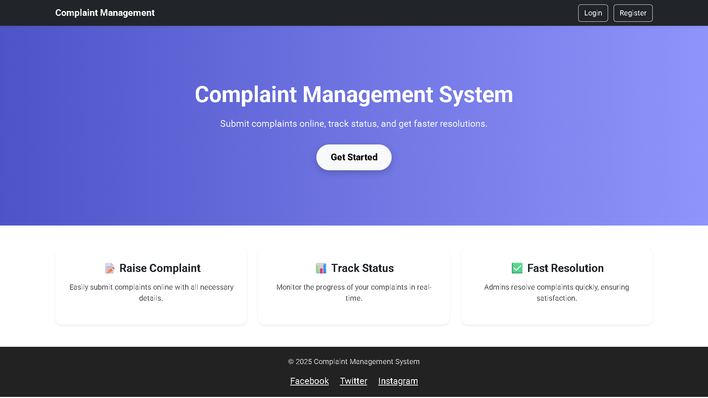
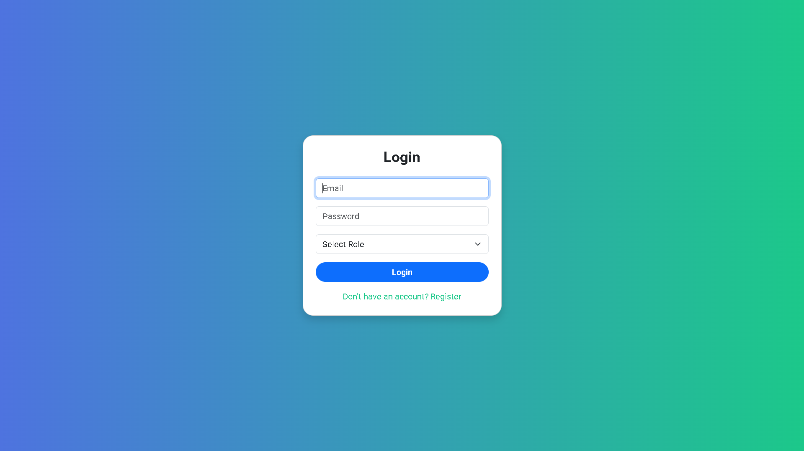
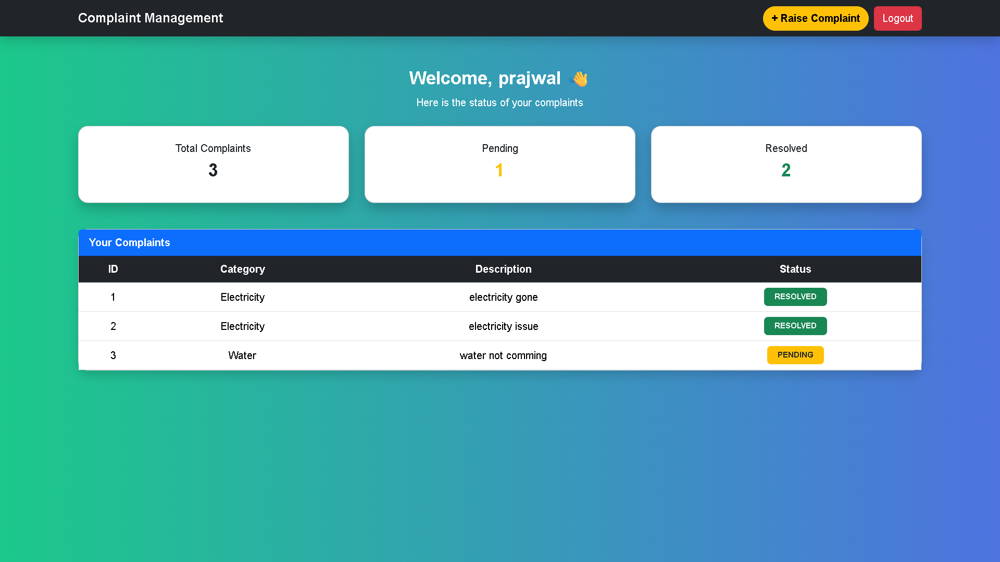
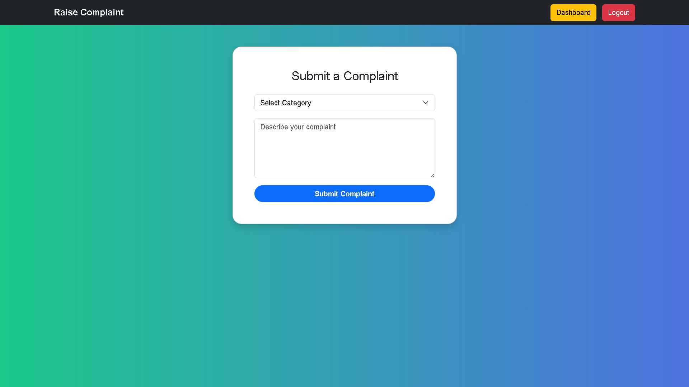
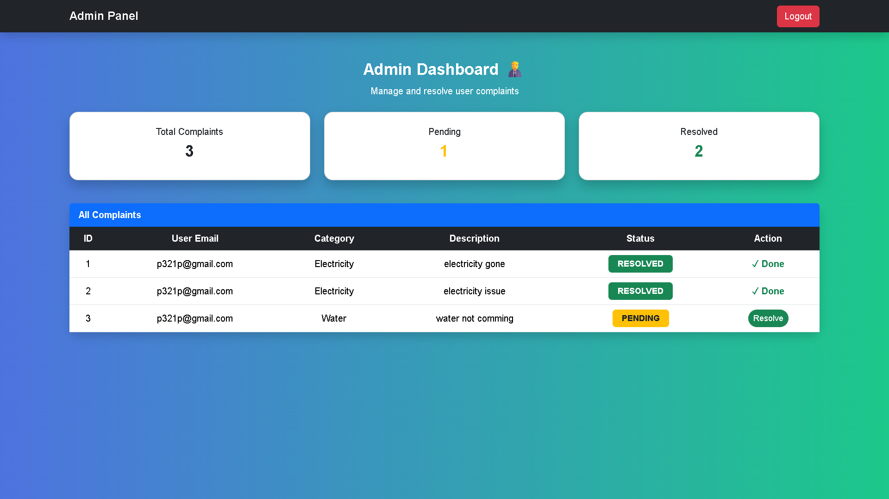

# 🏢 Complaint Management System

[](https://www.oracle.com/java/)
[](https://spring.io/projects/spring-boot)
[](https://www.thymeleaf.org/)
[](https://getbootstrap.com/)

A **full-stack web application** to manage complaints efficiently. Users can raise complaints and track their status, while admins can view and resolve them.

---

## 🌟 Features

### 👤 User
- ✅ Register and login.
- 📝 Raise complaints with category and description.
- 📊 View dashboard with statistics:
  - Total complaints
  - Pending complaints
  - Resolved complaints
- 🔍 Track complaint status in real-time.

### 🧑‍💼 Admin
- ✅ Admin login.
- 📋 View all complaints from users.
- ✔ Resolve complaints and update status.
- 📊 Dashboard with total, pending, and resolved complaints.

---

## 🎨 Screenshots

### Main Page


### Login Page


### User Dashboard


### Raise Complaint Page


### Admin Dashboard


---

## 🛠 Tech Stack
- **Backend:** Java 17, Spring Boot 3  
- **Frontend:** Thymeleaf, Bootstrap 5  
- **Database:** H2 / MySQL  
- **Build Tool:** Maven  

---

## 🚀 Installation & Setup

1. **Clone the repo**
```bash
git clone https://github.com/yourusername/complaint-management.git
cd complaint-management
